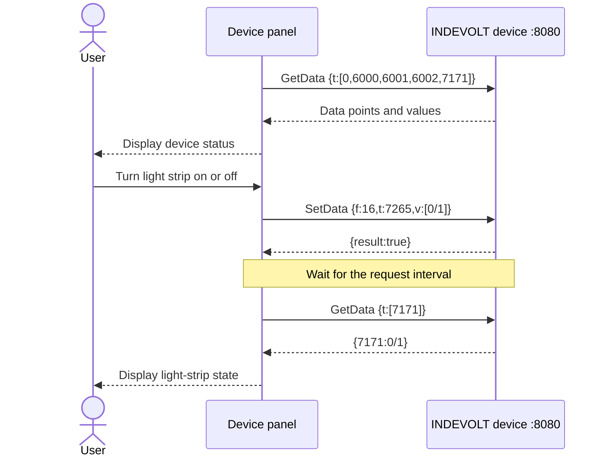

import Tabs from '@theme/Tabs';
import TabItem from '@theme/TabItem';

# Build a device panel with the OpenData HTTP API

This tutorial uses device-status reading and front-panel light-strip control to demonstrate the complete INDEVOLT OpenData HTTP API call flow.

## Python example

<iframe
  src="https://studio.flet.dev/apps/6puPy0aXh5"
  title="INDEVOLT OpenData HTTP API online example"
  loading="lazy"
  allow="local-network-access; local-network; loopback-network"
  style={{
    width: '100%',
    height: '760px',
    border: '1px solid var(--ifm-color-emphasis-300)',
    borderRadius: '8px',
  }}
/>

:::note Browser limitations

The online example runs in a browser and is suitable for viewing the interface and source code. Connecting to a real device requires the device to allow cross-origin browser requests. If the log shows `Failed to fetch`, download the Python source file and run it locally on the same network as the device.

[Open the online example](https://studio.flet.dev/apps/6puPy0aXh5) · <a href="/downloads/indevolt-opendata-panel.py" download="main.py">Download the Python source file</a>

:::

## OpenData call rules

The OpenData HTTP API base address is:

```text
http://{device IP}:8080/rpc/{API name}
```

This tutorial uses two APIs:

|API|`config`|Successful response|
| --- | --- | --- |
|[`Indevolt.GetData`](../http/api-reference.md#indevoltgetdata)|`{"t":[6002]}`|Returns a JSON object that maps data points to their current values|
|[`Indevolt.SetData`](../http/api-reference.md#indevoltsetdata)|`{"f":16,"t":7265,"v":[1]}`|Returns `{"result":true}`|

Both APIs use `POST`. Operation parameters are placed in the URL's `config` query parameter:

```text
POST http://{device IP}:8080/rpc/{API name}?config={JSON configuration}
```

Keep the following rules in mind:

- A request interval of at least 5 seconds is recommended. The minimum interval supported by the device is 1 second.
- `GetData` can read multiple cJSON data points in one request.
- A `SetData` response containing `result: true` means that the write request was executed. The device panel reads the status point after the write to confirm the final state.
- Supported cJSON data points can vary by product. See the [API Reference](../http/api-reference.md) for complete definitions.

## Device panel call flow

The device panel has two call paths: refresh device data and control the light strip.



## Call the API step by step with cURL or PowerShell

### Before you start

|Item|Requirement|
| --- | --- |
|Device|Any SolidFlex or PowerFlex series product with [OpenData HTTP enabled](../http/overview.md#enable-api)|
|Network|The computer and device are on the same trusted local network|
|Device information|You have the device IPv4 address, for example `192.168.1.75`|
|Debugging tool|cURL in Bash/Zsh, or Windows PowerShell|

### Step 1: Read one data point

First read battery SOC point `6002` to confirm that the device address, network, and OpenData HTTP service are working.

Replace `192.168.1.75` with your device IP address, then run the command for your terminal:

<Tabs groupId="terminal">
  <TabItem value="bash-zsh" label="Bash / Zsh" default>

```bash
DEVICE_IP="192.168.1.75"

curl --noproxy "${DEVICE_IP}" -g -X POST \
  -H "Content-Type: application/json" \
  "http://${DEVICE_IP}:8080/rpc/Indevolt.GetData?config={\"t\":[6002]}"
```

  </TabItem>
  <TabItem value="powershell" label="PowerShell">

```powershell
$DeviceIp = "192.168.1.75"
$Config = [uri]::EscapeDataString('{"t":[6002]}')

$Response = Invoke-RestMethod -Method Post `
  -Uri "http://${DeviceIp}:8080/rpc/Indevolt.GetData?config=${Config}" `
  -ContentType "application/json"

$Response | ConvertTo-Json -Compress
```

  </TabItem>
</Tabs>

The `config` object for `GetData` has one required field:

```json
{
  "t": [6002]
}
```

|Field|Type|Meaning|
| --- | --- | --- |
|`t`|Array|The list of cJSON data points to read in this request|

A successful response looks like this:

```json
{
  "6002": 76
}
```

The response is a JSON object. Each key is a cJSON data point represented as a string, and its value is the current device value. In this example, the battery SOC is `76%`.

### Step 2: Read all panel data in one request

`GetData` accepts multiple data points in the `t` array. The device panel reads:

|Interface data|Data point|Type or unit|Value description|
| --- | ---: | --- | --- |
|Device serial number|`0`|String|Device serial number|
|Battery DC power|`6000`|W|A positive value indicates discharging; a negative value indicates charging|
|Charge/discharge state|`6001`|Enum|`1000` idle, `1001` charging, `1002` discharging|
|Battery SOC|`6002`|%|Overall battery SOC|
|Front-panel light-strip state|`7171`|Enum|`0` off, `1` on|

Read all points in one request:

<Tabs groupId="terminal">
  <TabItem value="bash-zsh" label="Bash / Zsh" default>

```bash
DEVICE_IP="192.168.1.75"

curl --noproxy "${DEVICE_IP}" -g -X POST \
  -H "Content-Type: application/json" \
  "http://${DEVICE_IP}:8080/rpc/Indevolt.GetData?config={\"t\":[0,6000,6001,6002,7171]}"
```

  </TabItem>
  <TabItem value="powershell" label="PowerShell">

```powershell
$DeviceIp = "192.168.1.75"
$Config = [uri]::EscapeDataString('{"t":[0,6000,6001,6002,7171]}')

$Response = Invoke-RestMethod -Method Post `
  -Uri "http://${DeviceIp}:8080/rpc/Indevolt.GetData?config=${Config}" `
  -ContentType "application/json"

$Response | ConvertTo-Json -Compress
```

  </TabItem>
</Tabs>

The following response demonstrates the relationship between fields. The actual serial number and values depend on the device response:

```json
{
  "0": "YOUR_DEVICE_SN",
  "6000": -420,
  "6001": 1001,
  "6002": 76,
  "7171": 1
}
```

The interface maps the data points as follows:

- Display point `0` directly as the device serial number.
- Add the unit `W` to point `6000` without discarding its sign.
- Convert point `6001` using the enum table. Preserve an unknown raw value instead of displaying an incorrect state.
- Add the unit `%` to point `6002` and check that the value is within a reasonable range.
- Update the light-strip switch only when point `7171` returns `0` or `1`.

### Step 3: Write the light-strip control point

SolidFlex and PowerFlex series products use write point `7265` to control the front-panel light strip:

|Write value|Meaning|
| ---: | --- |
|`0`|Turn off the light strip|
|`1`|Turn on the light strip|

The `config` object for `SetData` contains three fields:

```json
{
  "f": 16,
  "t": 7265,
  "v": [1]
}
```

|Field|Type|Meaning|
| --- | --- | --- |
|`f`|Number|Function code, fixed at `16`|
|`t`|Number|The cJSON data point to write|
|`v`|Array|The value to write; its format is defined by the target data point|

The following request turns on the light strip:

<Tabs groupId="terminal">
  <TabItem value="bash-zsh" label="Bash / Zsh" default>

```bash
DEVICE_IP="192.168.1.75"

curl --noproxy "${DEVICE_IP}" -g -X POST \
  -H "Content-Type: application/json" \
  "http://${DEVICE_IP}:8080/rpc/Indevolt.SetData?config={\"f\":16,\"t\":7265,\"v\":[1]}"
```

  </TabItem>
  <TabItem value="powershell" label="PowerShell">

```powershell
$DeviceIp = "192.168.1.75"
$Config = [uri]::EscapeDataString('{"f":16,"t":7265,"v":[1]}')

$Response = Invoke-RestMethod -Method Post `
  -Uri "http://${DeviceIp}:8080/rpc/Indevolt.SetData?config=${Config}" `
  -ContentType "application/json"

$Response | ConvertTo-Json -Compress
```

  </TabItem>
</Tabs>

When the device accepts the write, it returns:

```json
{
  "result": true
}
```

`result: true` means that the write request was executed successfully. The application should still read the status point to confirm the device's final state.

### Step 4: Read the state after writing

The light-strip write point is `7265`, while its status point is `7171`. After writing, wait for the recommended request interval and then read `7171`:

<Tabs groupId="terminal">
  <TabItem value="bash-zsh" label="Bash / Zsh" default>

```bash
DEVICE_IP="192.168.1.75"

sleep 5
curl --noproxy "${DEVICE_IP}" -g -X POST \
  -H "Content-Type: application/json" \
  "http://${DEVICE_IP}:8080/rpc/Indevolt.GetData?config={\"t\":[7171]}"
```

  </TabItem>
  <TabItem value="powershell" label="PowerShell">

```powershell
$DeviceIp = "192.168.1.75"
$Config = [uri]::EscapeDataString('{"t":[7171]}')

Start-Sleep -Seconds 5
$Response = Invoke-RestMethod -Method Post `
  -Uri "http://${DeviceIp}:8080/rpc/Indevolt.GetData?config=${Config}" `
  -ContentType "application/json"

$Response | ConvertTo-Json -Compress
```

  </TabItem>
</Tabs>

When the light strip is on, the response should contain:

```json
{
  "7171": 1
}
```

To turn off the light strip, change `v` in `SetData` to `[0]`, then read `7171` again. The interface should report success only when the value read back matches the target value.

## Troubleshooting

|Symptom|Check first|
| --- | --- |
|Cannot connect|Confirm the device IP address, that the computer and device are on the same local network, that OpenData HTTP is enabled, and that port `8080` is reachable|
|Returns `400`|Confirm that `config` is valid JSON, `t` is an array, and `f`, `t`, and `v` use the correct types|
|Returns `404`|Confirm that the path is `/rpc/Indevolt.GetData` or `/rpc/Indevolt.SetData`|
|Response is missing a data point|Confirm that the current model supports the point and that the request's `t` array includes it|
|Request does not run immediately|Check whether the client is waiting for the recommended 5-second request interval|
|Write fails|Confirm that the target point is writable and that the value is within the point's allowed range|
|Write succeeds but the value read back differs|Wait for the request interval and read the status point again; do not update the interface from the write response alone|

## Related documentation

- [INDEVOLT OpenData Overview](../overview/introduction.md)
- [OpenData HTTP request format, rate limit, and error codes](../http/overview.md)
- [`Indevolt.GetData` and `Indevolt.SetData` API Reference](../http/api-reference.md)
