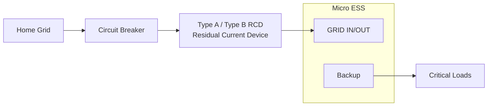
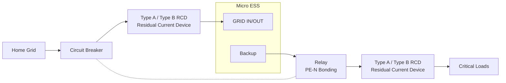

# RCD Installation Guide

## 1. What is an RCD?

RCD (Residual Current Device), also known as a residual current protection device, is an electrical protection device used to protect people and equipment from electrical hazards.

Under normal conditions, current flows through the live line (L) and neutral line (N), forming a complete circuit. When abnormal leakage occurs in equipment or wiring, for example:

- Insulation damage occurs inside the equipment;
- Current flows to the equipment enclosure;
- A person comes into contact with a live part;

part of the current may flow to the ground through an unintended path, causing an imbalance between the current in the live and neutral lines. An RCD detects this abnormal current and automatically disconnects the power supply when the protection threshold is reached, reducing the risk of electric shock and equipment damage.

In simple terms:

- **Under normal conditions**: Current flows normally, and the RCD remains closed;
- **In the event of leakage current**: The RCD detects abnormal current and automatically disconnects the circuit.

---

## 2. Connection Methods

**Grid-connected Mode**

When the device operates in grid-connected mode, the PE of the Backup output is connected to the input PE. The grounding reference is provided by the grid grounding system.

**Off-grid Mode**

For Class II double-insulated devices (such as lamps or chargers with plastic housings), the device enclosure does not rely on protective earth (PE) for safety. The risk of leakage current is relatively low, and only a Type A or Type B RCD is required.

For Class I devices (such as washing machines and heaters), the enclosure may become live in the event of a leakage fault. A relay is required to connect PE and N, establishing a system grounding reference, followed by the use of a Type A or Type B RCD.

:::tip
INDEVOLT uses an isolated inverter design, where the DC side and AC side are electrically isolated. Therefore, a Type A RCD can be used.
:::

---

## 3. Off-Grid Grounding Considerations

### Floating Output

When the system uses a floating output configuration, meaning there is no connection between the output neutral (N) and protective earth (PE):

* The first leakage fault may not create an effective fault current path;
* The RCD may not detect the fault and trip immediately.

### Single-Point N-PE Bonding

By installing a single-point connection between N and PE on the output side:

* A system grounding reference can be established;
* A fault current path can be created when leakage occurs on the equipment enclosure;
* The RCD can detect leakage current more reliably and disconnect the power supply.

---

## 4. RCD Type Selection

RCDs are mainly classified into Type A and Type B according to the types of leakage current they can detect.

INDEVOLT micro energy storage systems are compatible with both Type A and Type B RCDs. To achieve more comprehensive leakage protection, **the use of a Type B RCD is recommended**.

| Type       | Detectable Leakage Current Types          | Typical Applications                   | INDEVOLT Micro Energy Storage |
| ---------- | ------------------------------------------------------------------------------------------------------------------------------------------------------------------------------------- | ----------------------------------------------------------------------------------------------------------------------------------------------------------------------------------------------------------------------------------------------------- | - |
| Type A RCD | - Sinusoidal AC residual current - Pulsating DC residual current                                                                                                                 | - Standard household socket circuits - Common household appliances, such as refrigerators, washing machines, and incandescent lamps - Circuits without PV inverters, EV chargers, variable-frequency air conditioners, or similar equipment | ✅ |
| Type B RCD | - Sinusoidal AC residual current - Pulsating DC residual current - Smooth DC residual current - High-frequency AC residual current - Mixed AC/DC residual current | - PV inverters - Energy storage systems - EV charging equipment - Equipment with variable-speed drives                                                                                                                                 | ✅ |

