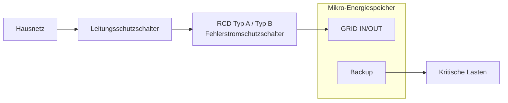
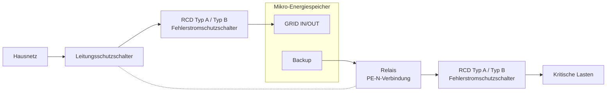

# RCD-Installationsanleitung

## 1. Was ist ein RCD?

RCD (Residual Current Device, Fehlerstrom-Schutzeinrichtung), auch als Fehlerstromschutzschalter (FI-Schutzschalter) bezeichnet, ist eine elektrische Schutzeinrichtung zum Schutz von Personen und Geräten.

Unter normalen Bedingungen fließt der Strom über den Außenleiter (L) und den Neutralleiter (N) und bildet einen geschlossenen Stromkreis. Wenn ein anormater Fehlerstrom in Geräten oder Leitungen auftritt, zum Beispiel:

- Beschädigung der Isolierung im Gerät;
- Stromfluss zum Gerätegehäuse;
- Kontakt einer Person mit spannungsführenden Teilen;

kann ein Teil des Stroms über einen unerwünschten Pfad zur Erde abfließen. Dadurch entsteht ein Ungleichgewicht zwischen dem Strom im Außenleiter und Neutralleiter. Ein RCD erkennt diesen Fehlerstrom und trennt die Stromversorgung automatisch, sobald die Auslösebedingungen erfüllt sind. Dadurch wird das Risiko eines Stromschlags und von Geräteschäden reduziert.

Kurz gesagt:

- **Unter normalen Bedingungen**: Der Strom fließt ordnungsgemäß, und der RCD bleibt eingeschaltet;
- **Bei einem Fehlerstrom**: Der RCD erkennt den abnormalen Strom und trennt den Stromkreis automatisch.

---

## 2. Anschlussarten

**Netzgekoppelter Betrieb**

Wenn das Gerät im netzgekoppelten Betrieb arbeitet, ist der PE-Leiter des Backup-Ausgangs mit dem Eingangs-PE verbunden. Die Erdungsreferenz wird durch das Erdungssystem des Stromnetzes bereitgestellt.

**Inselbetrieb**

Bei Geräten der Klasse II mit doppelter Isolierung (z. B. Leuchten oder Ladegeräte mit Kunststoffgehäuse) ist das Gerätegehäuse nicht auf den Schutzleiter (PE) angewiesen. Das Risiko eines Fehlerstroms ist relativ gering, daher ist nur ein RCD Typ A oder Typ B erforderlich.

Bei Geräten der Klasse I (z. B. Waschmaschinen oder Heizgeräte) kann das Gehäuse im Fehlerfall unter Spannung stehen. In diesem Fall muss ein Relais PE und N verbinden, um eine System-Erdungsreferenz herzustellen. Anschließend wird ein RCD Typ A oder Typ B verwendet.

:::tip
INDEVOLT verwendet ein galvanisch getrenntes Wechselrichterdesign, bei dem die Gleichstromseite und die Wechselstromseite elektrisch voneinander getrennt sind. Daher kann ein RCD Typ A verwendet werden.
:::

---

## 3. Hinweise zur Erdung im Inselbetrieb

### Schwimmender Ausgang

Wenn das System mit einem schwimmenden Ausgang betrieben wird, das heißt, dass keine Verbindung zwischen dem Ausgangs-Neutralleiter (N) und dem Schutzleiter (PE) besteht:

* Kann der erste Fehlerstrom möglicherweise keinen wirksamen Fehlerstrompfad bilden;
* Kann der RCD den Fehler möglicherweise nicht sofort erkennen und auslösen.

### Einpunktige N-PE-Verbindung

Durch eine einzelne Verbindung zwischen N und PE auf der Ausgangsseite:

* Kann ein Erdungsbezugspunkt für das System hergestellt werden;
* Kann bei einem Fehler am Gerätegehäuse ein Fehlerstrompfad entstehen;
* Kann der RCD Fehlerströme zuverlässiger erkennen und die Stromversorgung trennen.

---

## 4. Auswahl des RCD-Typs

RCDs werden hauptsächlich anhand der erkennbaren Fehlerstromarten in Typ A und Typ B unterteilt.

INDEVOLT Mikro-Energiespeichersysteme unterstützen sowohl RCDs vom Typ A als auch vom Typ B. Für einen umfassenderen Fehlerstromschutz wird **die Verwendung eines RCDs vom Typ B empfohlen**.

| Typ       | Erkennbare Fehlerstromarten                                                                                                                                                                                    | Typische Anwendungen                                                                                                                                                                                                                   | INDEVOLT Mikro-Energiespeicher |
| --------- | -------------------------------------------------------------------------------------------------------------------------------------------------------------------------------------------------------------- | -------------------------------------------------------------------------------------------------------------------------------------------------------------------------------------------------------------------------------------- | - |
| RCD Typ A | - Sinusförmiger Wechselstrom-Fehlerstrom - Pulsierender Gleichstrom-Fehlerstrom                                                                                                                           | - Standard-Haushaltssteckdosenkreise - Herkömmliche Haushaltsgeräte wie Kühlschränke, Waschmaschinen und Glühlampen - Stromkreise ohne PV-Wechselrichter, EV-Ladegeräte, Frequenzumrichter-Klimaanlagen oder ähnliche Geräte | ✅ |
| RCD Typ B | - Sinusförmiger Wechselstrom-Fehlerstrom - Pulsierender Gleichstrom-Fehlerstrom - Glatter Gleichstrom-Fehlerstrom - Hochfrequenter Wechselstrom-Fehlerstrom - Gemischter AC/DC-Fehlerstrom | - PV-Wechselrichter - Energiespeichersysteme - EV-Ladegeräte - Geräte mit drehzahlgeregelten Antrieben                                                                                                                  | ✅ |

