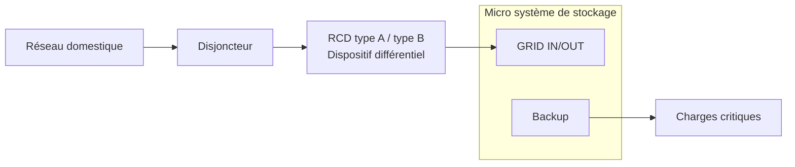
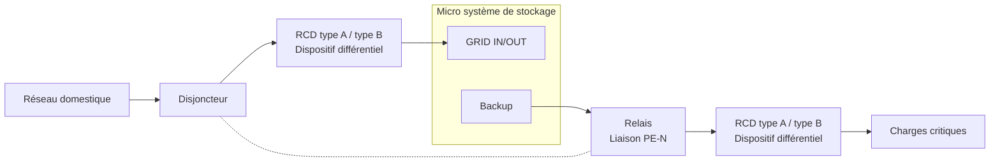

# Guide d'installation du RCD

## 1. Qu'est-ce qu'un RCD ?

Un RCD (Residual Current Device, dispositif différentiel à courant résiduel), également appelé interrupteur différentiel, est un dispositif de protection électrique conçu pour protéger les personnes et les équipements.

Dans des conditions normales, le courant circule dans un circuit fermé via le conducteur de phase (L) et le conducteur neutre (N). Lorsqu'un courant de fuite anormal apparaît dans un équipement ou une installation électrique, par exemple :

- Détérioration de l'isolation interne de l'équipement ;
- Courant circulant vers le boîtier de l'équipement ;
- Contact d'une personne avec une partie sous tension ;

une partie du courant peut circuler vers la terre par un chemin non prévu. Cela provoque un déséquilibre entre le courant circulant dans le conducteur de phase et celui dans le conducteur neutre. Le RCD détecte ce courant anormal et coupe automatiquement l'alimentation lorsque les conditions de protection sont atteintes, réduisant ainsi les risques d'électrocution et de dommages matériels.

En résumé :

- **En fonctionnement normal** : le courant circule normalement et le RCD reste fermé ;
- **En cas de courant de fuite** : le RCD détecte le courant anormal et coupe automatiquement le circuit.

---

## 2. Méthodes de raccordement

**Mode raccordé au réseau**

Lorsque l'appareil fonctionne en mode raccordé au réseau, le PE de la sortie Backup est relié au PE d'entrée. La référence de mise à la terre provient du système de mise à la terre du réseau électrique.

**Mode hors réseau**

Pour les appareils de classe II à double isolation (par exemple, les luminaires ou chargeurs avec un boîtier en plastique), le boîtier de l'appareil ne dépend pas du conducteur de protection (PE) pour la sécurité. Le risque de courant de fuite est relativement faible ; un RCD de type A ou de type B suffit.

Pour les appareils de classe I (par exemple, les lave-linge ou les appareils de chauffage), le boîtier peut devenir sous tension en cas de défaut d'isolement. Un relais est alors nécessaire pour relier le PE et le N afin d'établir une référence de mise à la terre du système, puis un RCD de type A ou de type B doit être utilisé.

:::tip
INDEVOLT utilise une conception avec onduleur isolé, dans laquelle le côté CC et le côté CA sont séparés électriquement. Par conséquent, un RCD de type A peut être utilisé.
:::

---

## 3. Mise à la terre hors réseau

### Sortie flottante

Lorsque le système utilise une configuration de sortie flottante, c'est-à-dire qu'il n'existe aucune connexion entre le neutre de sortie (N) et la terre de protection (PE) :

* Le premier défaut d'isolement peut ne pas créer un chemin de courant de défaut efficace ;
* Le RCD peut ne pas détecter immédiatement le défaut et ne pas déclencher.

### Liaison N-PE en un point unique

En installant une liaison unique entre N et PE côté sortie :

* Un point de référence de mise à la terre du système peut être établi ;
* Un chemin de courant de défaut peut être créé en cas de fuite sur le boîtier de l'équipement ;
* Le RCD peut détecter les courants de fuite de manière plus fiable et couper l'alimentation.

---

## 4. Sélection du type de RCD

Selon les types de courants de fuite détectables, les RCD sont principalement classés en type A et type B.

Les micro systèmes de stockage d'énergie INDEVOLT sont compatibles avec les RCD de type A et de type B. Pour bénéficier d'une protection plus complète contre les courants de fuite, **l'utilisation d'un RCD de type B est recommandée**.

| Type       | Types de courants de fuite détectables                                                                                                                                                                      | Applications typiques                                                                                                                                                                                                                                                                                | INDEVOLT Micro stockage d'énergie |
| ---------- | ----------------------------------------------------------------------------------------------------------------------------------------------------------------------------------------------------------- | ---------------------------------------------------------------------------------------------------------------------------------------------------------------------------------------------------------------------------------------------------------------------------------------------------- | - |
| RCD type A | - Courant résiduel alternatif sinusoïdal - Courant résiduel continu pulsé                                                                                                                              | - Circuits de prises domestiques standard - Appareils électroménagers courants tels que réfrigérateurs, lave-linge et lampes à incandescence - Circuits sans onduleur photovoltaïque, borne de recharge pour véhicule électrique, climatiseur à vitesse variable ou équipements similaires | ✅ |
| RCD type B | - Courant résiduel alternatif sinusoïdal - Courant résiduel continu pulsé - Courant résiduel continu lisse - Courant résiduel alternatif haute fréquence - Courant résiduel mixte CA/CC | - Onduleurs photovoltaïques - Systèmes de stockage d'énergie - Équipements de recharge pour véhicules électriques - Équipements équipés d'entraînements à vitesse variable                                                                                                            | ✅ |
