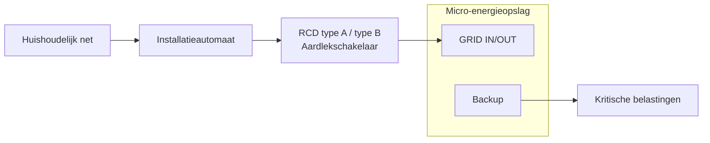
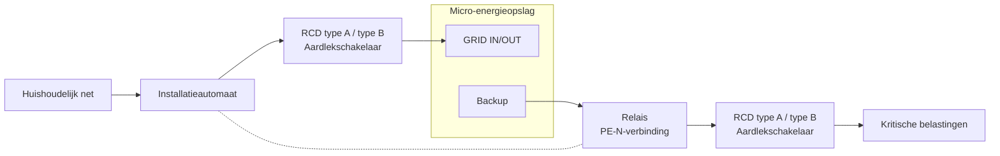

# RCD-installatiehandleiding

## 1. Wat is een RCD?

Een RCD (Residual Current Device, aardlekschakelaar) is een elektrische beveiliging die wordt gebruikt om personen en apparatuur te beschermen. 

Onder normale omstandigheden stroomt de stroom via de fasegeleider (L) en de nulgeleider (N) en vormt deze een gesloten circuit. Wanneer er een abnormale lekstroom optreedt in apparatuur of bedrading, bijvoorbeeld:

- Beschadigde isolatie in het apparaat;
- Stroom die naar de behuizing van het apparaat vloeit;
- Contact van een persoon met een spanningsvoerend onderdeel;

kan een deel van de stroom via een ongewenst pad naar de aarde vloeien. Hierdoor ontstaat een onbalans tussen de stroom in de fase- en nulgeleider. Een RCD detecteert deze abnormale stroom en schakelt de voeding automatisch uit wanneer aan de beveiligingsvoorwaarden wordt voldaan. Hierdoor wordt het risico op elektrische schokken en schade aan apparatuur verminderd.

Kort gezegd:

- **Onder normale omstandigheden**: De stroom vloeit normaal en de RCD blijft ingeschakeld;
- **Bij een lekstroom**: De RCD detecteert de abnormale stroom en schakelt het circuit automatisch uit.

---

## 2. Aansluitmethoden

**Netgekoppelde modus**

Wanneer het apparaat in de netgekoppelde modus werkt, wordt de PE van de Backup-uitgang verbonden met de PE van de ingang. De aardingsreferentie wordt geleverd door het aardingssysteem van het elektriciteitsnet.

**Off-grid modus**

Voor apparaten van klasse II met dubbele isolatie (zoals lampen of opladers met een kunststof behuizing) is de behuizing van het apparaat niet afhankelijk van de beschermingsleiding (PE) voor veiligheid. Het risico op lekstroom is relatief laag; alleen een RCD type A of type B is vereist.

Voor apparaten van klasse I (zoals wasmachines en verwarmingstoestellen) kan de behuizing bij een isolatiefout onder spanning komen te staan. Er is dan een relais nodig om PE en N met elkaar te verbinden en zo een systeemaardingsreferentie te creëren. Daarna wordt een RCD type A of type B toegepast.

:::tip
INDEVOLT maakt gebruik van een geïsoleerd omvormerontwerp, waarbij de gelijkstroomzijde en wisselstroomzijde elektrisch van elkaar gescheiden zijn. Daarom kan een RCD type A worden gebruikt.
:::

---

## 3. Aarding bij off-grid

### Zwevende uitgang

Wanneer het systeem gebruikmaakt van een zwevende uitgang, waarbij er geen verbinding is tussen de uitgangsnulgeleider (N) en de beschermingsgeleider (PE):

* Kan de eerste foutstroom mogelijk geen effectief foutstroompad vormen;
* Kan de RCD de fout mogelijk niet onmiddellijk detecteren en uitschakelen.

### Enkelvoudige N-PE-verbinding

Door aan de uitgangszijde een enkelvoudige verbinding tussen N en PE te maken:

* Kan een aardingsreferentie voor het systeem worden gecreëerd;
* Kan bij een lekstroom op de behuizing van het apparaat een foutstroompad ontstaan;
* Kan de RCD lekstromen betrouwbaarder detecteren en de voeding uitschakelen.

---

## 4. Selectie van het RCD-type

Op basis van de soorten lekstromen die kunnen worden gedetecteerd, worden RCD's voornamelijk onderverdeeld in type A en type B.

INDEVOLT micro-energieopslagsystemen zijn compatibel met zowel RCD's van type A als type B. Voor een uitgebreidere lekstroombescherming wordt **het gebruik van een RCD type B aanbevolen**.

| Type       | Detecteerbare lekstroomtypen                                                                                                                            | Typische toepassingen                                                                                                                                                                                                                                          | INDEVOLT Micro-energieopslag |
| ---------- | ------------------------------------------------------------------------------------------------------------------------------------------------------- | -------------------------------------------------------------------------------------------------------------------------------------------------------------------------------------------------------------------------------------------------------------- | - |
| RCD type A | - Sinusvormige AC-lekstroom - Pulserende DC-lekstroom                                                                                              | - Standaard huishoudelijke stopcontactgroepen - Algemene huishoudelijke apparaten zoals koelkasten, wasmachines en gloeilampen - Circuits zonder PV-omvormers, EV-laadapparatuur, airconditioners met frequentieregeling of vergelijkbare apparatuur | ✅ |
| RCD type B | - Sinusvormige AC-lekstroom - Pulserende DC-lekstroom - Gladde DC-lekstroom - Hoogfrequente AC-lekstroom - Gemengde AC/DC-lekstroom | - PV-omvormers - Energieopslagsystemen - EV-laadapparatuur - Apparatuur met variabele snelheidsregeling                                                                                                                                         | ✅ |
