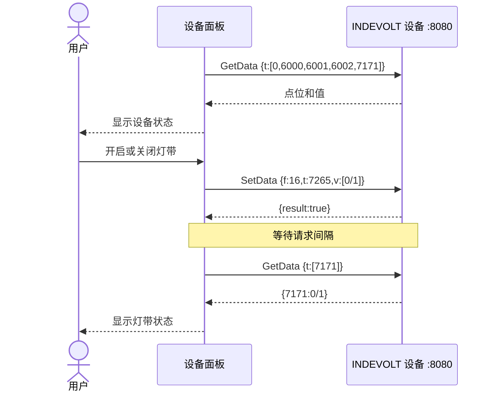

import Tabs from '@theme/Tabs';
import TabItem from '@theme/TabItem';

# 使用 OpenData HTTP API 构建设备面板

本文以读取设备状态和控制前面板灯带为例，展示 INDEVOLT OpenData HTTP API 的完整调用流程。

## Python 示例

<iframe
  src="https://studio.flet.dev/apps/6puPy0aXh5"
  title="INDEVOLT OpenData HTTP API 在线示例"
  loading="lazy"
  allow="local-network-access; local-network; loopback-network"
  style={{
    width: '100%',
    height: '760px',
    border: '1px solid var(--ifm-color-emphasis-300)',
    borderRadius: '8px',
  }}
/>

:::note 浏览器运行限制

在线示例在浏览器内运行，适合查看界面和源码。连接真实设备需要设备允许浏览器跨域请求；如日志出现 `Failed to fetch`，请下载 Python 源文件并在同一局域网内本地运行。

[打开在线示例](https://studio.flet.dev/apps/6puPy0aXh5) · <a href="/downloads/indevolt-opendata-panel.py" download="main.py">下载 Python 源文件</a>

:::

## OpenData 调用规则

OpenData HTTP API 的基础地址是：

```text
http://{设备 IP}:8080/rpc/{API 名称}
```

本期使用两个 API：

|API|`config`|成功响应|
| --- | --- | --- |
|[`Indevolt.GetData`](../http/api-reference.md#indevoltgetdata)|`{"t":[6002]}`|返回“点位 → 当前值”的 JSON 对象|
|[`Indevolt.SetData`](../http/api-reference.md#indevoltsetdata)|`{"f":16,"t":7265,"v":[1]}`|返回 `{"result":true}`|

两个 API 都使用 `POST`，操作参数放在 URL 的 `config` 查询参数中：

```text
POST http://{设备 IP}:8080/rpc/{API 名称}?config={JSON 配置}
```

调用时还需要注意：

- 建议请求间隔不少于 5 秒，设备最小支持间隔为 1 秒。
- `GetData` 可以在一次请求中读取多个 cJSON 点位。
- `SetData` 返回 `result: true` 表示写入请求已执行；设备面板会在写入后读取状态点位，确认最终状态。
- 不同产品支持的 cJSON 点位可能不同，完整定义见 [API 参考](../http/api-reference.md)。

## 设备面板调用流程

设备面板包含“刷新数据”和“控制灯带”两条调用路径：



## 使用 cURL 或 PowerShell 逐步调用

### 开始前准备

|项目|要求|
| --- | --- |
|设备|所有 SolidFlex 和 PowerFlex 系列产品；已[开启 OpenData HTTP](../http/overview.md#enable-api)|
|网络|操作终端与设备位于同一可信局域网|
|设备信息|已经获得设备 IPv4 地址，例如 `192.168.1.75`|
|调试工具|Bash/Zsh 中的 cURL，或 Windows PowerShell|

### 第一步：读取一个点位

先读取电池 SOC 点位 `6002`，确认设备地址、网络和 OpenData HTTP 服务均可用。

把示例中的 `192.168.1.75` 替换为你的设备 IP，然后选择对应终端执行：

<Tabs groupId="terminal">
  <TabItem value="bash-zsh" label="Bash / Zsh" default>

```bash
DEVICE_IP="192.168.1.75"

curl --noproxy "${DEVICE_IP}" -g -X POST \
  -H "Content-Type: application/json" \
  "http://${DEVICE_IP}:8080/rpc/Indevolt.GetData?config={\"t\":[6002]}"
```

  </TabItem>
  <TabItem value="powershell" label="PowerShell">

```powershell
$DeviceIp = "192.168.1.75"
$Config = [uri]::EscapeDataString('{"t":[6002]}')

$Response = Invoke-RestMethod -Method Post `
  -Uri "http://${DeviceIp}:8080/rpc/Indevolt.GetData?config=${Config}" `
  -ContentType "application/json"

$Response | ConvertTo-Json -Compress
```

  </TabItem>
</Tabs>

`GetData` 的 `config` 对象只有一个必填字段：

```json
{
  "t": [6002]
}
```

|字段|类型|含义|
| --- | --- | --- |
|`t`|数组|本次请求需要读取的 cJSON 点位列表|

成功响应类似：

```json
{
  "6002": 76
}
```

响应是一个 JSON 对象：键是字符串形式的 cJSON 点位，值是设备当前值。这里表示电池 SOC 为 `76%`。

### 第二步：一次读取面板数据

`GetData` 支持在 `t` 数组中放入多个点位。设备面板需要读取：

|界面数据|点位|类型或单位|值说明|
| --- | ---: | --- | --- |
|设备序列号|`0`|字符串|设备 SN|
|电池直流功率|`6000`|W|正值表示放电，负值表示充电|
|充放电状态|`6001`|枚举|`1000` 静止、`1001` 充电、`1002` 放电|
|电池 SOC|`6002`|%|整机电池 SOC|
|前面板灯带状态|`7171`|枚举|`0` 关闭、`1` 开启|

用一个请求读取全部点位：

<Tabs groupId="terminal">
  <TabItem value="bash-zsh" label="Bash / Zsh" default>

```bash
DEVICE_IP="192.168.1.75"

curl --noproxy "${DEVICE_IP}" -g -X POST \
  -H "Content-Type: application/json" \
  "http://${DEVICE_IP}:8080/rpc/Indevolt.GetData?config={\"t\":[0,6000,6001,6002,7171]}"
```

  </TabItem>
  <TabItem value="powershell" label="PowerShell">

```powershell
$DeviceIp = "192.168.1.75"
$Config = [uri]::EscapeDataString('{"t":[0,6000,6001,6002,7171]}')

$Response = Invoke-RestMethod -Method Post `
  -Uri "http://${DeviceIp}:8080/rpc/Indevolt.GetData?config=${Config}" `
  -ContentType "application/json"

$Response | ConvertTo-Json -Compress
```

  </TabItem>
</Tabs>

下面是一个用于说明字段关系的响应示例；实际序列号和数值以设备返回为准：

```json
{
  "0": "YOUR_DEVICE_SN",
  "6000": -420,
  "6001": 1001,
  "6002": 76,
  "7171": 1
}
```

界面使用以下点位映射：

- `0` 直接作为设备序列号显示。
- `6000` 添加单位 `W`，不要丢失正负号。
- `6001` 按枚举表转换；遇到未知值时保留原始值，避免显示错误状态。
- `6002` 添加单位 `%`，并校验是否位于合理范围。
- `7171` 只有返回 `0` 或 `1` 时才更新灯带开关。

### 第三步：写入灯带控制点位

SolidFlex 和 PowerFlex 系列使用写入点位 `7265` 控制前面板灯带：

|写入值|含义|
| ---: | --- |
|`0`|关闭灯带|
|`1`|开启灯带|

`SetData` 的 `config` 对象包含三个字段：

```json
{
  "f": 16,
  "t": 7265,
  "v": [1]
}
```

|字段|类型|含义|
| --- | --- | --- |
|`f`|数字|功能码，固定为 `16`|
|`t`|数字|需要写入的 cJSON 点位|
|`v`|数组|写入值，格式由目标点位定义|

以下请求把灯带设置为开启：

<Tabs groupId="terminal">
  <TabItem value="bash-zsh" label="Bash / Zsh" default>

```bash
DEVICE_IP="192.168.1.75"

curl --noproxy "${DEVICE_IP}" -g -X POST \
  -H "Content-Type: application/json" \
  "http://${DEVICE_IP}:8080/rpc/Indevolt.SetData?config={\"f\":16,\"t\":7265,\"v\":[1]}"
```

  </TabItem>
  <TabItem value="powershell" label="PowerShell">

```powershell
$DeviceIp = "192.168.1.75"
$Config = [uri]::EscapeDataString('{"f":16,"t":7265,"v":[1]}')

$Response = Invoke-RestMethod -Method Post `
  -Uri "http://${DeviceIp}:8080/rpc/Indevolt.SetData?config=${Config}" `
  -ContentType "application/json"

$Response | ConvertTo-Json -Compress
```

  </TabItem>
</Tabs>

设备接受写入时返回：

```json
{
  "result": true
}
```

`result: true` 表示写入请求已成功执行。应用还应读取状态点位，确认设备最终状态。

### 第四步：写入后读取状态

灯带的写入点位是 `7265`，状态读取点位是 `7171`。写入后按照建议请求间隔等待，再读取 `7171`：

<Tabs groupId="terminal">
  <TabItem value="bash-zsh" label="Bash / Zsh" default>

```bash
DEVICE_IP="192.168.1.75"

sleep 5
curl --noproxy "${DEVICE_IP}" -g -X POST \
  -H "Content-Type: application/json" \
  "http://${DEVICE_IP}:8080/rpc/Indevolt.GetData?config={\"t\":[7171]}"
```

  </TabItem>
  <TabItem value="powershell" label="PowerShell">

```powershell
$DeviceIp = "192.168.1.75"
$Config = [uri]::EscapeDataString('{"t":[7171]}')

Start-Sleep -Seconds 5
$Response = Invoke-RestMethod -Method Post `
  -Uri "http://${DeviceIp}:8080/rpc/Indevolt.GetData?config=${Config}" `
  -ContentType "application/json"

$Response | ConvertTo-Json -Compress
```

  </TabItem>
</Tabs>

灯带已开启时，响应应包含：

```json
{
  "7171": 1
}
```

关闭灯带时，把 `SetData` 中的 `v` 改为 `[0]`，随后再次读取 `7171`。只有读回值与目标值一致时，界面才显示操作成功。

## 故障检查

|现象|优先检查|
| --- | --- |
|无法连接|设备 IP 是否正确；操作终端与设备是否在同一局域网；OpenData HTTP 是否启用；`8080` 端口是否可达|
|返回 `400`|`config` 是否为有效 JSON；`t` 是否为数组；`f/t/v` 是否使用正确类型|
|返回 `404`|路径是否为 `/rpc/Indevolt.GetData` 或 `/rpc/Indevolt.SetData`|
|响应缺少点位|当前型号是否支持该点位；请求中的 `t` 是否包含该点位|
|请求没有立即执行|客户端是否正在等待建议的 5 秒请求间隔|
|写入返回失败|目标点位是否可写；写入值是否在点位允许范围内|
|写入成功但读回不一致|等待请求间隔后重新读取状态点位，不要仅依据写入响应更新界面|

## 相关资料

- [INDEVOLT OpenData 介绍](../overview/introduction.md)
- [OpenData HTTP 请求格式、频率和错误码](../http/overview.md)
- [`Indevolt.GetData` 与 `Indevolt.SetData` API 参考](../http/api-reference.md)
