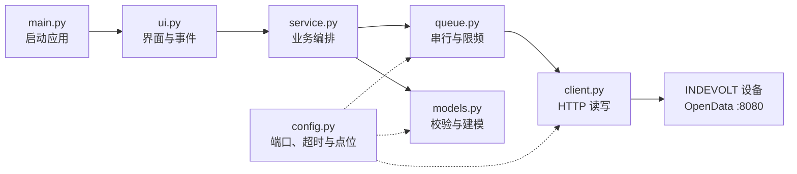

import Tabs from '@theme/Tabs';
import TabItem from '@theme/TabItem';

# 使用 OpenData 构建本地设备面板

通过阅读本文档并按照其中的步骤完成示例项目，你可以得到一个可在常见桌面操作系统上运行的 INDEVOLT OpenData 桌面 App。这个 App 可以显示设备序列号、电池 SOC、充放电状态、电池直流功率和前面板灯带状态，并支持自动刷新、手动刷新以及开启或关闭前面板灯带。

## 运行条件

|项目|配置|
| ----------| ----------------------------------------------------------|
|设备|SolidFlex 2000 或 PowerFlex 2000，已启用 OpenData HTTP|
|网络|运行面板的计算机与设备位于同一可信局域网，已获得设备 IPv4 地址|
|开发环境|Windows、macOS 或 Linux，Python 3.13、uv|
|项目依赖|Flet 0.86.5、Requests 2.34.2|
|构建环境|根据目标平台准备对应工具链，具体要求见文末 Flet 官方构建文档|

OpenData HTTP 服务使用设备的 `8080` 端口。请求格式、错误码和数据点定义以 [OpenData HTTP 说明](../http/overview.md) 与 [HTTP API Reference](../http/api-reference.md) 为准。

## 项目结构

完成本教程后，项目目录如下。根目录保存项目配置和启动入口，`indevolt_panel/` 保存设备通信、业务逻辑与界面代码：

```text
indevolt-opendata-panel/
├── .python-version
├── README.md                 # 项目说明
├── pyproject.toml
├── uv.lock
├── .venv/
├── main.py                   # App 启动入口
└── indevolt_panel/
    ├── __init__.py
    ├── config.py             # 端口、超时、请求间隔和点位常量
    ├── client.py             # OpenData HTTP 读取与写入
    ├── queue.py              # 请求排队、限频和后台执行
    ├── models.py             # 响应校验和面板数据模型
    ├── service.py            # 面板读取、灯带写入和状态读回
    └── ui.py                 # ui 定义
```

其中 `.python-version`、`README.md` 和 `pyproject.toml` 由 `uv init` 创建；`.venv/` 与 `uv.lock` 在添加依赖时生成；`main.py` 和 `indevolt_panel/` 中的模块由后续步骤填写。

### 模块调用关系

用户在界面发起操作后，请求依次经过服务层、请求队列和 HTTP 客户端，再到达设备。服务层同时负责把设备响应转换成可供界面显示的面板数据：



## 创建全部目录和文件

选择与你当前终端对应的标签页，然后完整复制其中的命令执行。两组命令都会创建项目目录、进入项目目录、创建 7 个业务模块并列出结果。

<Tabs groupId="terminal">
  <TabItem value="bash-zsh" label="Bash / Zsh" default>

```bash
uv init --no-package --python 3.13 --vcs none indevolt-opendata-panel
cd indevolt-opendata-panel

mkdir -p indevolt_panel
touch indevolt_panel/{__init__,config,client,queue,models,service,ui}.py

find . -maxdepth 2 -type f | sort
```

  </TabItem>
  <TabItem value="powershell" label="PowerShell">

```powershell
uv init --no-package --python 3.13 --vcs none indevolt-opendata-panel
Set-Location indevolt-opendata-panel

New-Item -ItemType Directory -Force indevolt_panel | Out-Null
"__init__", "config", "client", "queue", "models", "service", "ui" |
  ForEach-Object {
    New-Item -ItemType File -Force "indevolt_panel/$_.py" | Out-Null
  }

Get-ChildItem -File -Recurse |
  ForEach-Object {
    "./" + $_.FullName.Substring($PWD.Path.Length + 1).Replace("\", "/")
  } |
  Sort-Object
```

  </TabItem>
</Tabs>

文件列表应包含以下内容：

```text
./.python-version
./README.md
./indevolt_panel/__init__.py
./indevolt_panel/client.py
./indevolt_panel/config.py
./indevolt_panel/models.py
./indevolt_panel/queue.py
./indevolt_panel/service.py
./indevolt_panel/ui.py
./main.py
./pyproject.toml
```

## 添加项目依赖

下面的命令会把依赖写入 `pyproject.toml`，同时创建 `.venv`、安装依赖并生成 `uv.lock`：

```bash
uv add "flet==0.86.5" "requests==2.34.2"
```

## 定义 OpenData 常量

:::info 代码块的使用方式

从这里开始，标题标有“完整文件内容”的代码块表示该文件最终应包含的全部代码。请打开指定文件，清空原有内容，完整复制代码块并粘贴保存；不要把新代码追加到旧代码后面。

:::

### 完整文件内容：`indevolt_panel/config.py`

```python
# OpenData HTTP 服务参数
PORT = 8080
TIMEOUT_SECONDS = 10.0

# 本教程采用 OpenData 文档建议的 5 秒请求间隔
MIN_REQUEST_INTERVAL = 5.0

# 面板读取的设备点位
SERIAL_NUMBER = "0"
BATTERY_POWER = "6000"
BATTERY_STATE = "6001"
BATTERY_SOC = "6002"

# 灯带状态读取和灯带控制写入使用不同点位
LIGHT_STATE = "7171"
LIGHT_WRITE = "7265"

# 每次刷新在一个 GetData 请求中读取全部面板点位
READ_POINTS = (
    SERIAL_NUMBER,
    BATTERY_POWER,
    BATTERY_STATE,
    BATTERY_SOC,
    LIGHT_STATE,
)

# 把设备返回的状态值转换成界面文案
STATE_NAMES = {
    1000: "待机",
    1001: "充电",
    1002: "放电",
}
```

## 实现 OpenData HTTP 通信

`Indevolt.GetData` 的 `config` 参数为 `{"t":[点位]}`，响应直接返回点位和值；`Indevolt.SetData` 的参数为 `{"f":16,"t":点位,"v":[值]}`，成功响应包含 `{"result":true}`。

### 完整文件内容：`indevolt_panel/client.py`

```python
import json
from collections.abc import Sequence
from typing import Any

import requests

from .config import PORT, TIMEOUT_SECONDS


class OpenDataError(RuntimeError):
    """表示 OpenData 传输、协议或响应格式错误。"""

    pass


class OpenDataClient:
    def __init__(self, host: str) -> None:
        self._base_url = f"http://{host}:{PORT}/rpc"

        # 使用独立 Session 统一管理本设备的请求设置和资源。
        self._session = requests.Session()

        # 局域网设备请求不继承系统代理和默认身份验证设置。
        self._session.trust_env = False

        # OpenData 示例使用 JSON 内容类型；每次响应后关闭当前连接。
        self._session.headers.update({
            "Content-Type": "application/json",
            "Connection": "close",
        })

    def _post(self, method: str, config: dict[str, Any]) -> dict[str, Any]:
        try:
            with self._session.post(
                f"{self._base_url}/{method}",
                # OpenData RPC 要求把紧凑 JSON 放在 config 查询参数中。
                params={"config": json.dumps(config, separators=(",", ":"))},
                # 设备无响应时及时失败，并且不跟随离开设备地址的重定向。
                timeout=TIMEOUT_SECONDS,
                allow_redirects=False,
            ) as response:
                if response.status_code != 200:
                    raise OpenDataError(f"设备返回 HTTP {response.status_code}")
                payload = response.json()
        except requests.RequestException as error:
            raise OpenDataError(f"OpenData 请求失败：{error}") from error

        if not isinstance(payload, dict):
            raise OpenDataError("设备返回的 JSON 不是对象")
        return payload

    def get_data(self, points: Sequence[str]) -> dict[str, Any]:
        return self._post("Indevolt.GetData", {"t": [int(p) for p in points]})

    def set_data(self, point: str, value: int) -> bool:
        payload = self._post(
            "Indevolt.SetData",
            {"f": 16, "t": int(point), "v": [int(value)]},
        )
        # 只有 JSON 布尔值 true 才表示设备接受了写入。
        return payload.get("result") is True

    def close(self) -> None:
        self._session.close()
```

这段客户端代码包含的不只是 `trust_env`，各项设置分别解决不同问题：

|设置或检查|作用|
| ----------| ----------------------------------------------------------|
|`requests.Session()`|集中保存该设备的请求头和连接设置，并在退出时统一释放资源|
|`trust_env = False`|不采用环境中的代理和默认身份验证配置，避免局域网设备请求被交给外部代理|
|`Content-Type: application/json`|与 OpenData HTTP 示例中的请求头保持一致|
|`Connection: close`|明确要求当前 HTTP 连接在响应后关闭，不依赖设备端长期保持连接|
|`timeout=10`|设备无响应时最多等待 10 秒，避免一次请求无限阻塞|
|`allow_redirects=False`|设备返回重定向时立即停止，不把请求继续发送到其他地址|
|状态码和 JSON 类型检查|只接受 HTTP 200 且顶层为对象的响应，其余情况统一抛出 `OpenDataError`|

Requests 默认会信任代理、默认身份验证等环境设置；这里关闭的是当前 OpenData `Session` 的环境继承，不影响应用中的其他 HTTP 客户端。具体行为见 [Requests `Session.trust_env` 官方说明](https://requests.readthedocs.io/en/stable/api/#requests.Session)。

## 控制 OpenData 请求顺序

:::note 为什么不在按钮事件中直接请求设备？

直接调用 `requests` 会产生三个问题：

1. `requests` 是同步 I/O；在 Flet 事件循环中直接调用时，窗口会在等待设备响应期间卡住。
2. 自动刷新、手动刷新和灯带控制可能同时触发；如果各自直接请求，设备可能在同一时间收到多个请求。
3. OpenData HTTP 文档建议相邻请求间隔不少于 5 秒，最小支持间隔为 1 秒。本教程采用建议值，并让所有读取和写入共用同一套限频规则。

因此需要保留“串行、限频、后台执行”这三个行为。把它们放在独立的 `queue.py` 只是为了集中管理，并不是必须单独建文件；小型项目也可以把相同逻辑放进 `service.py`，但不应直接删除这些行为。

:::

### 完整文件内容：`indevolt_panel/queue.py`

```python
import asyncio
from collections.abc import Callable
from typing import TypeVar

from .config import MIN_REQUEST_INTERVAL

# 保留传入函数的返回类型，例如 dict 或 bool。
T = TypeVar("T")


class RequestQueue:
    """串行执行设备请求，并统一限制相邻请求的起始间隔。"""

    def __init__(self) -> None:
        # 同一时刻只允许一个协程进入设备请求区段。
        self._lock = asyncio.Lock()

        # 记录上一次请求的开始时间；0.0 表示还没有发起过请求。
        self._last_started = 0.0

    async def run(self, request: Callable[[], T]) -> T:
        async with self._lock:
            loop = asyncio.get_running_loop()

            # loop.time() 使用单调时钟，不受系统时间调整影响。
            delay = MIN_REQUEST_INTERVAL - (loop.time() - self._last_started)
            if delay > 0:
                # 只等待尚未满足的间隔；sleep 不会阻塞 Flet 事件循环。
                await asyncio.sleep(delay)

            self._last_started = loop.time()

            # requests 是同步 I/O，放到工作线程后再异步等待结果。
            return await asyncio.to_thread(request)
```

自动刷新、手动刷新、灯带写入和灯带读回都通过 `run()` 执行：`asyncio.Lock` 保证一次只有一个设备请求；`loop.time()` 和 `asyncio.sleep()` 补足请求间隔；`asyncio.to_thread()` 把可能阻塞的 HTTP 调用放到工作线程，让界面事件循环继续响应。相关行为可参考 Python 官方的 [`asyncio.Lock`](https://docs.python.org/3.13/library/asyncio-sync.html#asyncio.Lock) 与 [`asyncio.to_thread()`](https://docs.python.org/3.13/library/asyncio-task.html#asyncio.to_thread) 文档。

## 解析面板数据

|界面字段|读取点位|有效值|
| --------------| ---------: | -----------------------------|
|设备序列号|`0`|非空字符串|
|电池直流功率|`6000`|整数，单位 `W`|
|充放电状态|`6001`|`1000` 待机、`1001` 充电、`1002` 放电|
|电池 SOC|`6002`|0–100，单位 `%`|
|灯带状态|`7171`|`0` 关闭、`1` 开启|

### 完整文件内容：`indevolt_panel/models.py`

```python
from dataclasses import dataclass
from typing import Any

from .config import (
    BATTERY_POWER,
    BATTERY_SOC,
    BATTERY_STATE,
    LIGHT_STATE,
    SERIAL_NUMBER,
    STATE_NAMES,
)


@dataclass(frozen=True, slots=True)
class PanelData:
    serial: str | None
    soc: int | None
    state: str
    battery_power: int | None
    front_light: bool | None


def integer_value(data: dict[str, Any], key: str, low=None, high=None):
    try:
        value = int(data[key])
    except (KeyError, TypeError, ValueError):
        return None
    if low is not None and value < low:
        return None
    if high is not None and value > high:
        return None
    return value


def parse_panel(data: dict[str, Any]) -> PanelData:
    state = integer_value(data, BATTERY_STATE)
    light = integer_value(data, LIGHT_STATE, 0, 1)
    serial = str(data.get(SERIAL_NUMBER, "")).strip() or None
    return PanelData(
        serial=serial,
        soc=integer_value(data, BATTERY_SOC, 0, 100),
        state=STATE_NAMES.get(
            state,
            "—" if state is None else f"未知（{state}）",
        ),
        battery_power=integer_value(data, BATTERY_POWER),
        front_light=None if light is None else bool(light),
    )
```

## 组织读取和灯带控制

灯带写入使用点位 `7265`。界面只在随后读回的 `7171` 与目标值一致时显示成功。

### 完整文件内容：`indevolt_panel/service.py`

```python
from .client import OpenDataClient, OpenDataError
from .config import LIGHT_STATE, LIGHT_WRITE, READ_POINTS
from .models import PanelData, integer_value, parse_panel
from .queue import RequestQueue


class PanelService:
    def __init__(self, host: str) -> None:
        self._client = OpenDataClient(host)
        self._queue = RequestQueue()

    async def read(self) -> PanelData:
        data = await self._queue.run(lambda: self._client.get_data(READ_POINTS))
        panel = parse_panel(data)
        if panel.serial is None:
            raise OpenDataError("响应缺少设备序列号")
        return panel

    async def set_front_light(self, enabled: bool) -> bool:
        accepted = await self._queue.run(
            lambda: self._client.set_data(LIGHT_WRITE, int(enabled))
        )
        if not accepted:
            return False
        data = await self._queue.run(
            lambda: self._client.get_data((LIGHT_STATE,))
        )
        return integer_value(data, LIGHT_STATE, 0, 1) == int(enabled)

    def close(self) -> None:
        self._client.close()
```

## 创建 Flet 窗口

界面文件只处理控件和事件。所有设备读写都交给 `PanelService`。

### 完整文件内容：`indevolt_panel/ui.py`

```python
import asyncio
from datetime import datetime
from ipaddress import AddressValueError, IPv4Address

import flet as ft

from .client import OpenDataError
from .models import PanelData
from .service import PanelService


async def main(page: ft.Page) -> None:
    page.title = "INDEVOLT OpenData Panel"
    service: PanelService | None = None
    stop = asyncio.Event()
    confirmed_light: bool | None = None

    host_input = ft.TextField(label="设备 IPv4", width=220)
    connect_button = ft.Button("连接")
    refresh_button = ft.Button("刷新", disabled=True)
    serial_text = ft.Text("序列号：—")
    soc_text = ft.Text("SOC：—")
    state_text = ft.Text("状态：—")
    power_text = ft.Text("电池功率：—")
    updated_text = ft.Text("更新时间：—")
    light_switch = ft.Switch(label="前面板灯带", disabled=True)
    status_text = ft.Text("未连接")

    def show(data: PanelData) -> None:
        nonlocal confirmed_light
        serial_text.value = f"序列号：{data.serial or '—'}"
        soc_text.value = f"SOC：{'—' if data.soc is None else f'{data.soc}%'}"
        state_text.value = f"状态：{data.state}"
        power = "—" if data.battery_power is None else f"{data.battery_power} W"
        power_text.value = f"电池功率：{power}"
        updated_text.value = datetime.now().astimezone().strftime(
            "更新时间：%H:%M:%S"
        )
        confirmed_light = data.front_light if data.serial else None
        light_switch.value = confirmed_light or False
        light_switch.disabled = confirmed_light is None

    async def refresh(_=None) -> bool:
        if service is None:
            return False
        refresh_button.disabled = True
        light_switch.disabled = True
        page.update()
        try:
            show(await service.read())
        except OpenDataError as error:
            status_text.value = f"连接失败：{error}"
            ok = False
        else:
            status_text.value = "已连接"
            ok = True
        refresh_button.disabled = False
        light_switch.disabled = confirmed_light is None
        page.update()
        return ok

    async def auto_refresh() -> None:
        while not stop.is_set():
            try:
                await asyncio.wait_for(stop.wait(), timeout=5.0)
            except TimeoutError:
                await refresh()

    async def connect(_=None) -> None:
        nonlocal service
        try:
            host = str(IPv4Address(host_input.value.strip()))
        except AddressValueError:
            status_text.value = "请输入有效的设备 IPv4"
            page.update()
            return

        candidate = PanelService(host)
        service = candidate
        connect_button.disabled = True
        if await refresh():
            host_input.disabled = True
            page.run_task(auto_refresh)
        else:
            candidate.close()
            service = None
            connect_button.disabled = False
        page.update()

    async def change_light(event) -> None:
        nonlocal confirmed_light
        if service is None:
            return
        desired = bool(event.control.value)
        light_switch.disabled = True
        status_text.value = "正在设置灯带"
        page.update()
        try:
            ok = await service.set_front_light(desired)
        except OpenDataError:
            ok = False
        if ok:
            confirmed_light = desired
            status_text.value = "灯带已开启" if desired else "灯带已关闭"
        else:
            light_switch.value = confirmed_light or False
            status_text.value = "灯带结果未确认"
        light_switch.disabled = confirmed_light is None
        page.update()

    async def window_event(event: ft.WindowEvent) -> None:
        if event.type == ft.WindowEventType.CLOSE:
            stop.set()
            if service is not None:
                service.close()
            await page.window.destroy()

    connect_button.on_click = connect
    refresh_button.on_click = refresh
    light_switch.on_change = change_light
    page.window.prevent_close = True
    page.window.on_event = window_event

    page.add(ft.Column([
        ft.Row([host_input, connect_button, refresh_button]),
        serial_text,
        ft.Row([soc_text, state_text, power_text]),
        light_switch,
        updated_text,
        status_text,
    ]))
```

## 添加启动入口

### 完整文件内容：`main.py`

```python
import flet as ft

from indevolt_panel.ui import main


if __name__ == "__main__":
    ft.run(main)
```

### 文件：`indevolt_panel/__init__.py`

保持为空。

## 开发运行

在项目目录运行：

```bash
uv run flet run main.py
```

窗口出现后输入设备 IPv4。首次读取成功时应显示设备序列号和面板数据，灯带开关随后可用。

## 验收

|场景|通过条件|
| ------------| ------------------------------------------------------------------|
|项目初始化|`uv init` 生成 4 个项目文件，7 个业务模块全部存在；`uv add` 后生成 `.venv` 和 `uv.lock`|
|模块边界|HTTP、请求队列、面板数据、界面和入口分别位于对应文件|
|首次连接|序列号、SOC、状态、直流功率和灯带状态同时更新|
|请求频率|自动刷新、手动刷新和灯带操作的相邻请求开始时间至少相隔 5 秒|
|界面响应|设备请求期间窗口仍可移动，控件不会冻结|
|异常响应|状态区显示错误，已成功显示的数据不被清空|
|打开灯带|写入 `7265=1`，随后读取 `7171=1`，界面显示“灯带已开启”|
|关闭灯带|写入 `7265=0`，随后读取 `7171=0`，界面显示“灯带已关闭”|
|写入未确认|写入失败或读回不一致时恢复最后一次确认值|
|退出|关闭窗口后停止自动刷新并释放设备连接资源|
|桌面应用|目标平台的构建产物可以启动并完成一次读取和一次灯带开关操作|

## 故障检查

|现象|检查项|
| ------------------------| ---------------------------------------------------------------------------------------|
|无法连接|设备与运行面板的计算机是否在同一局域网；OpenData HTTP 是否启用；IPv4 是否变化；`8080` 端口是否被隔离|
|请求超时|设备是否可达；防火墙是否拦截；窗口是否正在等待前一个请求完成|
|字段显示 `—`|响应是否包含对应点位；值是否为可转换的整数；SOC 和灯带值是否在允许范围内|
|刷新没有立即执行|是否正在等待满足 5 秒请求间隔|
|灯带结果未确认|`7265` 写入结果与下一次 `7171` 读回是否一致|
|依赖添加失败|`uv --version` 是否可用；网络是否可以访问依赖源；Python 3.13 是否成功安装|
|开发运行正常但构建失败|目标平台所需工具链、Flet 版本和平台限制是否符合 Flet 官方构建文档|

## 安全与数据处理

- 只在可信局域网中访问设备的 OpenData HTTP 服务，不把 `8080` 端口暴露到公网。
- OpenData HTTP 调用设置有限超时、禁用环境代理并拒绝 HTTP 重定向。
- 灯带写入只允许 `0` 和 `1`，并且只能由当前窗口中的用户操作触发。
- 首次读取设备序列号并显示在窗口后，才启用写入控件。
- 设备 IP、序列号和响应正文进入日志、截图或问题报告前先脱敏。

## 相关资料

- [INDEVOLT OpenData 介绍](../overview/introduction.md)
- [INDEVOLT OpenData HTTP 说明](../http/overview.md)
- [INDEVOLT OpenData HTTP API Reference](../http/api-reference.md)
- [uv 项目文档](https://docs.astral.sh/uv/guides/projects/)
- [Requests 文档](https://requests.readthedocs.io/)
- [Flet 异步应用](https://flet.dev/docs/cookbook/async-apps/)

## 按平台构建

Flet 使用 `flet build <target>` 为目标平台生成应用。构建工具和前置依赖因平台而异，开始前请查看 [Flet 官方构建说明](https://flet.dev/docs/publish/) 和 [`flet build` 命令参考](https://flet.dev/docs/cli/flet-build/)。

在项目目录中按目标平台运行：

|目标平台|执行构建的环境|命令|
| --------| ----------------------| -------------------------------------------------------------|
|[Windows](https://flet.dev/docs/publish/windows/)|Windows|`uv run flet build windows . --python-version 3.13`|
|[macOS](https://flet.dev/docs/publish/macos/)|macOS|`uv run flet build macos . --python-version 3.13`|
|[Linux](https://flet.dev/docs/publish/linux/)|Linux，或 Windows 中的 WSL|`uv run flet build linux . --python-version 3.13`|

需要构建 Web、Android 或 iOS 版本时，请先查看 Flet 官方对应平台说明；这些平台可能还需要配置网络权限，并调整本教程中的桌面窗口相关代码。
