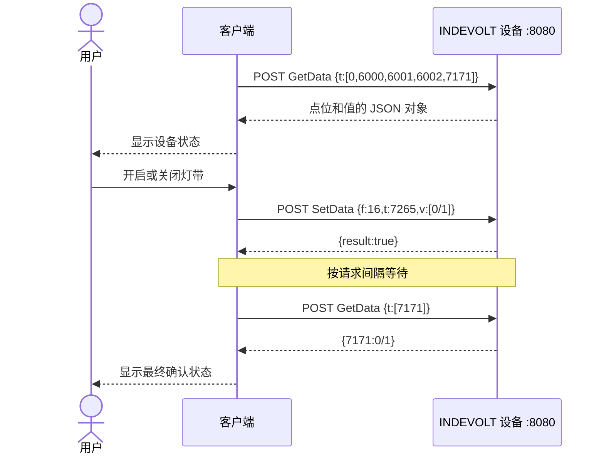

import Tabs from '@theme/Tabs';
import TabItem from '@theme/TabItem';

# 使用 OpenData HTTP API 构建设备面板

本文通过“读取设备状态并控制前面板灯带”这个完整场景，说明如何调用 INDEVOLT OpenData HTTP API。

教程的重点是 HTTP 请求、`config` 参数、cJSON 点位、响应处理和调用约束。文末提供的 Flet Studio 完整示例演示同一调用流程，并可直接查看项目源码；掌握前面的 API 后，你可以使用任意编程语言和界面框架实现相同功能。

:::info 完成本教程后，你将能够

- 通过设备 IP 组成 OpenData HTTP API 地址。
- 使用 `Indevolt.GetData` 一次读取一个或多个 cJSON 点位。
- 识别设备序列号、功率、充放电状态、SOC 和灯带状态。
- 使用 `Indevolt.SetData` 开启或关闭前面板灯带。
- 在写入后读取状态点位，确认设备最终状态。
- 正确处理请求间隔、HTTP 错误和异常响应。

:::

## 开始前准备

|项目|要求|
| --- | --- |
|设备|SolidFlex 2000 或 PowerFlex 2000，已启用 OpenData HTTP|
|网络|操作终端与设备位于同一可信局域网|
|设备信息|已经获得设备 IPv4 地址，例如 `192.168.1.75`|
|调试工具|Bash/Zsh 中的 cURL，或 Windows PowerShell|

OpenData HTTP 服务监听设备的 `8080` 端口。请勿把该端口暴露到公网。

## 理解 OpenData HTTP 请求

OpenData HTTP API 的基础地址是：

```text
http://{设备 IP}:8080/rpc/{API 名称}
```

本教程使用两个 API：

|API|用途|
| --- | --- |
|`Indevolt.GetData`|读取一个或多个 cJSON 点位的当前值|
|`Indevolt.SetData`|向一个可写 cJSON 点位写入值|

两个 API 都使用 `POST`。具体操作放在 URL 的 `config` 查询参数中：

```text
POST http://{设备 IP}:8080/rpc/{API 名称}?config={JSON 配置}
```

为了便于阅读，文档会直接展示 JSON。实际使用 HTTP 客户端时，应让客户端对 `config` 查询参数进行 URL 编码；cURL 示例使用 `-g` 保留文档中的 JSON 写法。

## 第一步：读取一个点位

先读取电池 SOC 点位 `6002`，确认设备地址、网络和 OpenData HTTP 服务均可用。

把示例中的 `192.168.1.75` 替换为你的设备 IP，然后选择对应终端执行：

<Tabs groupId="terminal">
  <TabItem value="bash-zsh" label="Bash / Zsh" default>

```bash
DEVICE_IP="192.168.1.75"

curl -g -X POST \
  -H "Content-Type: application/json" \
  "http://${DEVICE_IP}:8080/rpc/Indevolt.GetData?config={\"t\":[6002]}"
```

  </TabItem>
  <TabItem value="powershell" label="PowerShell">

```powershell
$DeviceIp = "192.168.1.75"
$Config = [uri]::EscapeDataString('{"t":[6002]}')

$Response = Invoke-RestMethod -Method Post `
  -Uri "http://${DeviceIp}:8080/rpc/Indevolt.GetData?config=${Config}" `
  -ContentType "application/json"

$Response | ConvertTo-Json -Compress
```

  </TabItem>
</Tabs>

`GetData` 的 `config` 对象只有一个必填字段：

```json
{
  "t": [6002]
}
```

|字段|类型|含义|
| --- | --- | --- |
|`t`|数组|本次请求需要读取的 cJSON 点位列表|

成功响应类似：

```json
{
  "6002": 76
}
```

响应是一个 JSON 对象：Key 是字符串形式的 cJSON 点位，Value 是设备当前值。这里表示电池 SOC 为 `76%`。

## 第二步：一次读取面板数据

`GetData` 支持在 `t` 数组中放入多个点位。设备面板需要读取：

|界面数据|点位|类型或单位|值说明|
| --- | ---: | --- | --- |
|设备序列号|`0`|字符串|设备 SN|
|电池直流功率|`6000`|W|正值表示放电，负值表示充电|
|充放电状态|`6001`|枚举|`1000` 静止、`1001` 充电、`1002` 放电|
|电池 SOC|`6002`|%|整机电池 SOC|
|前面板灯带状态|`7171`|枚举|`0` 关闭、`1` 开启|

用一个请求读取全部点位：

<Tabs groupId="terminal">
  <TabItem value="bash-zsh" label="Bash / Zsh" default>

```bash
DEVICE_IP="192.168.1.75"

curl -g -X POST \
  -H "Content-Type: application/json" \
  "http://${DEVICE_IP}:8080/rpc/Indevolt.GetData?config={\"t\":[0,6000,6001,6002,7171]}"
```

  </TabItem>
  <TabItem value="powershell" label="PowerShell">

```powershell
$DeviceIp = "192.168.1.75"
$Config = [uri]::EscapeDataString('{"t":[0,6000,6001,6002,7171]}')

$Response = Invoke-RestMethod -Method Post `
  -Uri "http://${DeviceIp}:8080/rpc/Indevolt.GetData?config=${Config}" `
  -ContentType "application/json"

$Response | ConvertTo-Json -Compress
```

  </TabItem>
</Tabs>

下面是一个用于说明字段关系的响应示例；实际序列号和数值以设备返回为准：

```json
{
  "0": "YOUR_DEVICE_SN",
  "6000": -420,
  "6001": 1001,
  "6002": 76,
  "7171": 1
}
```

把响应转换成界面内容时，应遵守点位定义：

- `0` 直接作为设备序列号显示。
- `6000` 添加单位 `W`，不要丢失正负号。
- `6001` 按枚举表转换；遇到未知值时保留原始值，避免显示错误状态。
- `6002` 添加单位 `%`，并校验是否位于合理范围。
- `7171` 只有返回 `0` 或 `1` 时才更新灯带开关。

## 第三步：写入灯带控制点位

SolidFlex 2000 / PowerFlex 2000 使用写入点位 `7265` 控制前面板灯带：

|写入值|含义|
| ---: | --- |
|`0`|关闭灯带|
|`1`|开启灯带|

`SetData` 的 `config` 对象包含三个字段：

```json
{
  "f": 16,
  "t": 7265,
  "v": [1]
}
```

|字段|类型|含义|
| --- | --- | --- |
|`f`|数字|功能码，固定为 `16`|
|`t`|数字|需要写入的 cJSON 点位|
|`v`|数组|写入值，格式由目标点位定义|

以下请求把灯带设置为开启：

<Tabs groupId="terminal">
  <TabItem value="bash-zsh" label="Bash / Zsh" default>

```bash
DEVICE_IP="192.168.1.75"

curl -g -X POST \
  -H "Content-Type: application/json" \
  "http://${DEVICE_IP}:8080/rpc/Indevolt.SetData?config={\"f\":16,\"t\":7265,\"v\":[1]}"
```

  </TabItem>
  <TabItem value="powershell" label="PowerShell">

```powershell
$DeviceIp = "192.168.1.75"
$Config = [uri]::EscapeDataString('{"f":16,"t":7265,"v":[1]}')

$Response = Invoke-RestMethod -Method Post `
  -Uri "http://${DeviceIp}:8080/rpc/Indevolt.SetData?config=${Config}" `
  -ContentType "application/json"

$Response | ConvertTo-Json -Compress
```

  </TabItem>
</Tabs>

设备接受写入时返回：

```json
{
  "result": true
}
```

`result: true` 表示写入请求已成功执行。应用还应读取状态点位，确认设备最终状态。

## 第四步：写入后读取状态

灯带的写入点位是 `7265`，状态读取点位是 `7171`。写入后按照建议请求间隔等待，再读取 `7171`：

<Tabs groupId="terminal">
  <TabItem value="bash-zsh" label="Bash / Zsh" default>

```bash
DEVICE_IP="192.168.1.75"

sleep 5
curl -g -X POST \
  -H "Content-Type: application/json" \
  "http://${DEVICE_IP}:8080/rpc/Indevolt.GetData?config={\"t\":[7171]}"
```

  </TabItem>
  <TabItem value="powershell" label="PowerShell">

```powershell
$DeviceIp = "192.168.1.75"
$Config = [uri]::EscapeDataString('{"t":[7171]}')

Start-Sleep -Seconds 5
$Response = Invoke-RestMethod -Method Post `
  -Uri "http://${DeviceIp}:8080/rpc/Indevolt.GetData?config=${Config}" `
  -ContentType "application/json"

$Response | ConvertTo-Json -Compress
```

  </TabItem>
</Tabs>

灯带已开启时，响应应包含：

```json
{
  "7171": 1
}
```

关闭灯带时，把 `SetData` 中的 `v` 改为 `[0]`，随后再次读取 `7171`。只有读回值与目标值一致时，界面才显示操作成功。

## OpenData 调用规则

需要区分 OpenData 接口约束与客户端实现策略：

|类别|规则|本教程的处理方式|
| --- | --- | --- |
|接口建议|建议请求间隔 ≥ 5 秒|所有读取和写入共用 5 秒间隔|
|接口限制|最小支持间隔为 1 秒|不以 1 秒高频轮询设备|
|接口响应|成功读取返回“点位 → 当前值”的 JSON 对象|逐项检查点位是否存在、类型是否有效|
|接口响应|成功写入返回 `{"result":true}`|写入后再读取状态点位确认|
|客户端策略|局域网请求不应意外进入外部代理|OpenData 客户端不继承系统代理设置|
|客户端策略|设备无响应不能无限等待|示例客户端设置 10 秒超时|
|客户端策略|自动刷新、手动刷新和控制操作可能同时发生|示例客户端串行执行所有设备请求|
|客户端策略|设备地址不应被重定向替换|示例客户端不跟随 HTTP 重定向|

常见 HTTP 错误及完整说明见 [OpenData HTTP 错误码](../http/overview.md#errors)。客户端至少应区分以下情况：

- `400`：`config` JSON、字段或点位格式错误。
- `404`：API 名称或请求路径错误。
- `405`：请求方法错误，或对不支持的资源执行操作。
- `408`：设备等待请求超时。
- `500`–`504`：设备当前无法正常完成请求。

## 与编程语言无关的实现流程

任何技术栈都可以按照相同流程实现设备面板：

```text
设置 BASE_URL = http://{设备 IP}:8080/rpc

读取面板：
  POST /Indevolt.GetData
  config = {"t":[0,6000,6001,6002,7171]}
  校验 HTTP 200
  解析 JSON 对象
  按点位定义更新界面

控制灯带：
  校验用户目标值只能是 0 或 1
  POST /Indevolt.SetData
  config = {"f":16,"t":7265,"v":[目标值]}
  确认 result 为 true
  等待请求间隔
  POST /Indevolt.GetData
  config = {"t":[7171]}
  仅在读回值等于目标值时显示成功
```

完整交互顺序如下：



## 可选：在 Flet Studio 中查看完整示例

到这里，OpenData HTTP API 的核心用法已经讲完。下面的 Flet Studio 项目把同一调用流程实现为设备面板，项目页同时提供运行界面和完整源码。它只是可选示例，你不需要通过它学习 Python，也可以使用自己的技术栈实现相同功能。

<iframe
  src="https://studio.flet.dev/apps/6puPy0aXh5"
  title="INDEVOLT OpenData HTTP API Flet 完整示例"
  loading="lazy"
  allow="local-network-access; local-network; loopback-network"
  style={{
    width: '100%',
    height: '760px',
    border: '1px solid var(--ifm-color-emphasis-300)',
    borderRadius: '8px',
  }}
/>

如果嵌入区域未正常显示或需要更大的编辑空间，请[在 Flet Studio 中打开完整示例](https://studio.flet.dev/apps/6puPy0aXh5)。

:::note 浏览器运行限制

Flet Studio 中的代码在浏览器内运行。使用项目页预览界面或查看源码无需本地安装；若要连接局域网设备，浏览器可能要求授予局域网访问权限，设备端也需要允许相应的浏览器请求。需要稳定连接设备或构建桌面应用时，请从 Flet Studio 下载项目后在本地运行。

:::

这个示例中的 OpenData 对应关系是：

|示例行为|OpenData 调用|
| --- | --- |
|连接或刷新|`GetData` 读取 `0/6000/6001/6002/7171`|
|打开灯带|`SetData` 写入 `7265=1`，再读取 `7171`|
|关闭灯带|`SetData` 写入 `7265=0`，再读取 `7171`|
|自动刷新与手动操作|共用串行请求和 5 秒间隔|

## 验收 OpenData 调用

|场景|通过条件|
| --- | --- |
|读取单点|`GetData` 返回包含 `6002` 的 JSON 对象|
|读取多点|一次响应同时包含本例需要的五个点位|
|解析枚举|`6001` 的 `1000/1001/1002` 显示为对应状态|
|保留单位|`6000` 保留正负号并显示 `W`，`6002` 显示 `%`|
|开启灯带|写入 `7265=1` 返回 `result:true`，随后读到 `7171=1`|
|关闭灯带|写入 `7265=0` 返回 `result:true`，随后读到 `7171=0`|
|请求频率|所有相邻设备请求按建议值至少间隔 5 秒|
|异常响应|非 HTTP 200、无效 JSON 或缺少点位时不更新为成功状态|

## 故障检查

|现象|优先检查|
| --- | --- |
|无法连接|设备 IP 是否正确；操作终端与设备是否在同一局域网；OpenData HTTP 是否启用；`8080` 端口是否可达|
|返回 `400`|`config` 是否为有效 JSON；`t` 是否为数组；`f/t/v` 是否使用正确类型|
|返回 `404`|路径是否为 `/rpc/Indevolt.GetData` 或 `/rpc/Indevolt.SetData`|
|响应缺少点位|当前型号是否支持该点位；请求中的 `t` 是否包含该点位|
|请求没有立即执行|客户端是否正在等待建议的 5 秒请求间隔|
|写入返回失败|目标点位是否可写；写入值是否在点位允许范围内|
|写入成功但读回不一致|等待请求间隔后重新读取状态点位，不要仅依据写入响应更新界面|

## 安全与数据处理

- 只在可信局域网中访问设备，不把 `8080` 端口暴露到公网。
- 写入前校验点位和值，只允许用户明确触发控制操作。
- 为 HTTP 调用设置有限超时，不跟随离开设备地址的重定向。
- 设备 IP、序列号和响应正文进入日志、截图或问题报告前先脱敏。
- 不要用高频轮询绕过 OpenData 的请求间隔建议。

## 相关资料

- [INDEVOLT OpenData 介绍](../overview/introduction.md)
- [OpenData HTTP 请求格式、频率和错误码](../http/overview.md)
- [`Indevolt.GetData` 与 `Indevolt.SetData` API 参考](../http/api-reference.md)
- [Flet 异步应用](https://flet.dev/docs/cookbook/async-apps/)

## 按平台构建可选示例

如需把 Flet Studio 完整示例构建为本地应用，请先从项目页下载源码并解压，再在项目目录中按目标平台构建。开始前请查看 [Flet 官方构建说明](https://flet.dev/docs/publish/) 和 [`flet build` 命令参考](https://flet.dev/docs/cli/flet-build/)。

|目标平台|执行构建的环境|命令|
| --- | --- | --- |
|[Windows](https://flet.dev/docs/publish/windows/)|Windows|`uv run flet build windows . --python-version 3.13`|
|[macOS](https://flet.dev/docs/publish/macos/)|macOS|`uv run flet build macos . --python-version 3.13`|
|[Linux](https://flet.dev/docs/publish/linux/)|Linux，或 Windows 中的 WSL|`uv run flet build linux . --python-version 3.13`|

需要构建 Web、Android 或 iOS 版本时，请先查看 Flet 官方对应平台说明；这些平台可能还需要配置网络权限，并调整示例中的桌面窗口代码。
