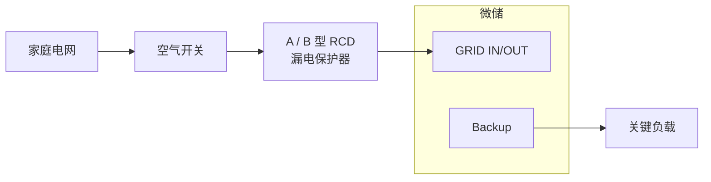
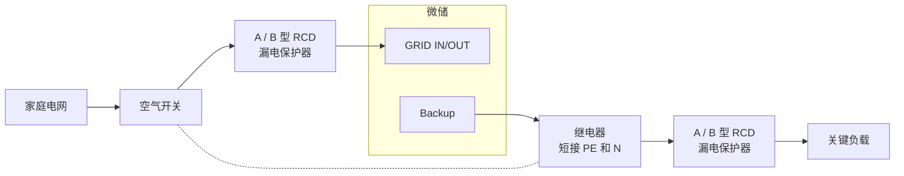

# 微储 RCD 安装说明

## 1. 什么是 RCD？

RCD（Residual Current Device，剩余电流保护装置），也称为漏电保护器，是一种用于保护人员和设备安全的电气保护装置。

正常情况下，电流会沿火线（L）和零线（N）形成完整回路流动。当设备或线路发生异常漏电时，例如：

- 设备内部绝缘损坏；
- 电流流向设备外壳；
- 人员接触带电部分；

部分电流会通过非正常路径流向大地，导致火线和零线中的电流不平衡。RCD 可以检测这种异常电流，并在达到保护条件时自动切断电源，降低触电和设备损坏风险。

简单来说：

- **正常情况下**：电流正常流动，RCD 保持接通；
- **发生漏电时**：RCD 检测到异常电流，并自动断开电路。

---

## 2. 连接方式

**并网**

当设备运行于并网模式时，Backup 输出的 PE 与输入 PE 相连，接地参考来自电网接地系统。

**离网**

对于 II 类双重绝缘设备（例如塑料外壳的灯具或充电器等），设备外壳不依赖保护接地，漏电风险相对较低，仅使用 A 型或 B 型 RCD 即可。

对于 I 类设备（例如洗衣机、加热器等），发生漏电时外壳可能带电，需要通过继电器将 PE 和 N 相连，建立系统接地参考，再使用 A 型或 B 型 RCD。

:::tip
INDEVOLT 采用**隔离型逆变器**设计，直流侧和交流侧电气隔离，因此**可使用 A 型 RCD**。
:::

---

## 3. 离网接地注意事项

### 浮地输出

当系统采用浮地输出方式，即输出端 N（零线）与 PE（保护地）之间没有连接：
- 第一次漏电可能无法形成有效故障电流路径；
- RCD 可能无法立即检测并动作；

### N-PE 单点接地

通过在输出侧设置 N-PE 单点连接：
- 可以建立系统接地参考；
- 设备外壳漏电时，可以形成故障电流路径；
- RCD 可以更可靠地检测漏电并切断电源。

---

## 4. RCD 类型

RCD 根据能够检测的漏电类型不同，主要分为 A 型和 B 型。

| 类型          | 可检测漏电类型                                                      | 适用场景                                                                 | INDEVOLT 微储 |
| ----------- | ------------------------------------------------------------ | -------------------------------------------------------------------- | - |
| A 型 RCD | - 正弦交流漏电 - 脉动直流漏电                                         | - 普通家庭插座回路 - 普通家庭用电设备，如冰箱、洗衣机、白炽灯等 - 不含光伏逆变器、EV 充电桩、变频空调等设备的回路 | ✅ |
| B 型 RCD | - 正弦交流漏电 - 脉动直流漏电 - 平滑直流漏电 - 高频交流漏电 - AC/DC 混合漏电 | - 光伏逆变器 - 储能系统 - EV 充电设备 - 含变频驱动的设备                         | ✅ |
